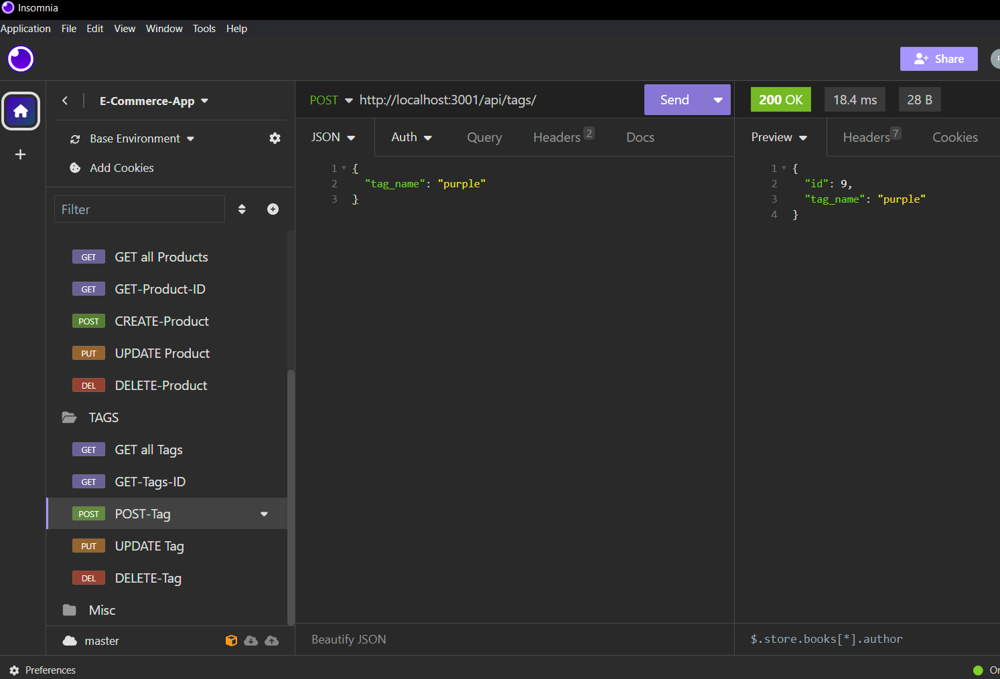

# E-Commerce Back-End


[](https://opensource.org/licenses/MIT)   

## Table of Contents

- [Description](#description)
- [Installation](#installation)
- [Usage](#usage)
- [Credits](#credits)
- [Screenshot](#screenshot)
- [Walkthrough Video](#walkthrough-video)
- [Contribute](#contribute)
- [License](#license)
- [Questions](#questions)

## Description

The task for this application was a challenge in the OSU bootcamp cirriculum to build the back end for an e-commerce site by modifying starter code. I configured an Express.js API to use Sequelize to interact with a MySQL database.  I then tested the CRUD ( create, read, update, and delete) routes in Insomonia.

## Acceptance Criteria

```md
GIVEN a functional Express.js API
WHEN I add my database name, MySQL username, and MySQL password to an environment variable file
THEN I am able to connect to a database using Sequelize
WHEN I enter schema and seed commands
THEN a development database is created and is seeded with test data
WHEN I enter the command to invoke the application
THEN my server is started and the Sequelize models are synced to the MySQL database
WHEN I open API GET routes in Insomnia for categories, products, or tags
THEN the data for each of these routes is displayed in a formatted JSON
WHEN I test API POST, PUT, and DELETE routes in Insomnia
THEN I am able to successfully create, update, and delete data in my database
```

## Installation
 - [Visual Studio Code](https://code.visualstudio.com/)
 - [node.js](https://nodejs.org/en)
 - [mysql2](https://www.npmjs.com/package/mysql2)
 - [dotenv](https://www.npmjs.com/package/dotenv)
 - [nodemon](https://www.npmjs.com/package/nodemon)
 - [express](https://www.npmjs.com/package/express)
 - [sequelize](https://www.npmjs.com/package/sequelize)
 - [insomnia](https://insomnia.rest/)
       

## Usage

1. Run `npm i` in the command line to make sure all installations are complete.
2. Open your MySQL shell with command `mysql -u root -p`
3. Use the `schema.sql` file in the db folder to create the database by typing `SOURCE db/schema.sql` in the MySQL shell.
4. Use environment variables to store sensitive data in the `.env` file, like your MySQL username, password, and database name.
5. From the CLI, type `npm run seed` to seed data to the database.
6. Then run `npm start` to start the server. ( Or to use nodemon type `npm run watch`)
7. From there open the Insomnia app to test the routes and use CRUD on the database.


## Screenshot



## Walkthrough Video

[Click here](https://drive.google.com/file/d/1Y3yKZ8JN94OyXOdmt4nxWv3-pZ3AKpJV/view)

## Credits

 - This application is an assignment from module 13 from [The Ohio State University Coding Boot Camp](https://eng-bootcamps.osu.edu/).  The Acceptance Criteria above is from the challenge in module 13.
 


## Contribute 

If you would like to contribute please use the [Contributor Covenant](https://www.contributor-covenant.org/).


## License

[](https://opensource.org/licenses/MIT)   

***MIT License***

## Questions

 - Github Profile for [rickibobbii](https://github.com/rickibobbii)
